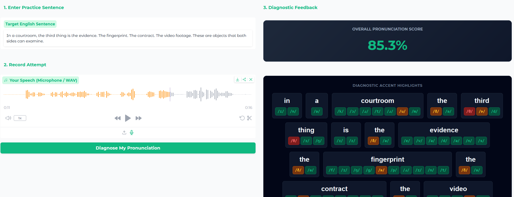
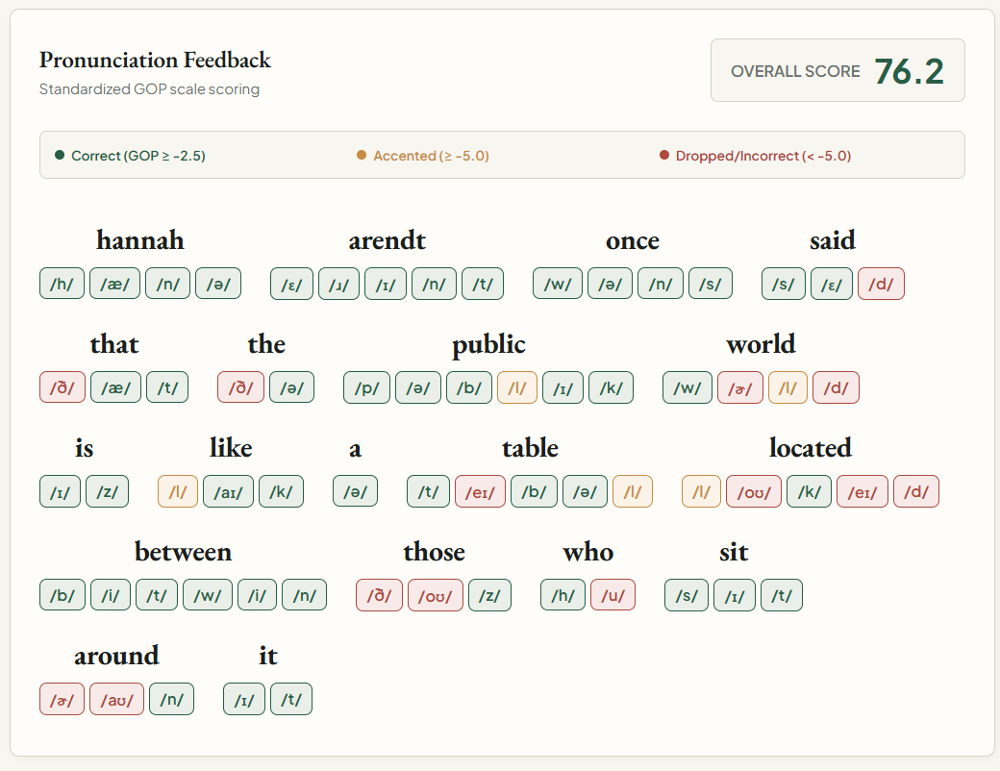

# Vienounce Core

[](LICENSE)
[](#)
[](README_EN.md)

---

Vienounce Core là một thư viện Python mã nguồn mở được thiết kế để phân tích phát âm tiếng Anh và phát hiện các lỗi ngôn ngữ L1 transfer phổ biến ở người nói tiếng Việt. Thư viện sử dụng không gian ngữ âm song ngữ thống nhất để căn biên (align) các bản ghi âm của người dùng và tạo phản hồi mức độ chuẩn phát âm (GOP - Goodness of Pronunciation) ở cấp độ âm tố (phone).

---

## 🖥️ Giao diện Gradio GUI 

Thư viện đi kèm với một bảng điều khiển Gradio tích hợp (`gui_local.py`) phục vụ cho việc luyện tập offline độc lập. Nó cho phép bạn nhập câu đích, ghi âm lượt thử của mình và xem các điểm nổi bật ở cấp độ âm tố cùng với điểm phát âm tổng thể ngay trên máy tính:



---

## ☁️ Giao diện Cloud 

Trong phiên bản Web, mô hình được huấn luyện tùy chỉnh của chúng tôi cũng so sánh với các bản tham chiếu giọng bản xứ chuẩn (Kokoro TTS) để giúp người học nghe rõ sự khác biệt do ảnh hưởng ngữ âm tiếng Việt:



---

## Tính năng chính

*   **Ánh xạ âm vị song ngữ**: Chuyển đổi các từ tiếng Anh mục tiêu một cách mượt mà bằng bộ phiên âm song ngữ `sea-g2p`.
*   **Chẩn đoán cấp độ âm tố**: Sử dụng mô hình căn biên âm học Wav2Vec2 (`facebook/wav2vec2-xlsr-53-espeak-cv-ft`) để căn khớp âm thanh với các âm tố IPA.
*   **Đánh giá mức độ chuẩn phát âm (GOP)**: Tính toán xác suất hậu nghiệm logarit (posterior log-probabilities) trên từng âm tố để chấm điểm độ chính xác.
*   **Ngưỡng đánh giá chuẩn hóa**: Ánh xạ điểm GOP sang các chỉ dấu trực quan trực quan:
    *   🟢 **Xanh lá (Chính xác)**: $\text{GOP} \ge -2.5$
    *   🟡 **Vàng (Giọng địa phương/Gần đạt)**: $-5.0 \le \text{GOP} < -2.5$
    *   🔴 **Đỏ (Nuốt âm/Sai)**: $\text{GOP} < -5.0$
*   **Ưu tiên chạy ngoại tuyến & Thân thiện với CPU**: Hoạt động hoàn toàn cục bộ, tải các mô hình trên CPU mà không cần cơ sở dữ liệu hay phụ thuộc vào lưu trữ đám mây.
*   **Giao diện Gradio GUI cục bộ**: Giao diện web tương tác (`gui_local.py`) để thử nghiệm đánh giá trên bất kỳ câu nào.

---

## Cài đặt

### Yêu cầu hệ thống
Đảm bảo đã cài đặt `ffmpeg` trên hệ thống của bạn để hỗ trợ chuyển đổi định dạng âm thanh:
```bash
# Trên Ubuntu/Debian:
sudo apt-get install ffmpeg
```

### Thiết lập môi trường ảo
Chúng tôi khuyên dùng `uv` hoặc `pip` trong môi trường ảo:
```bash
# Nhân bản kho lưu trữ và di chuyển đến thư mục core
cd vienounce-core

# Cài đặt ở chế độ chỉnh sửa trực tiếp (editable mode)
pip install -e .
```

---

## Bắt đầu nhanh

### 1. Khởi chạy bản thử nghiệm GUI độc lập
Chạy giao diện Gradio cục bộ:
```bash
python gui_local.py
```
Mở `http://127.0.0.1:7860` trong trình duyệt web, nhập câu đích, ghi âm lượt thử và nhấp vào **Chẩn đoán phát âm của tôi** (Diagnose My Pronunciation).

### 2. Sử dụng trực tiếp trong mã Python
Bạn có thể nhập trực tiếp `vienounce_core` vào tập lệnh tùy chỉnh của mình:

```python
import os
from vienounce_core.models import local_models
from vienounce_core.diagnostics import DiagnosticsService

# 1. Khởi tạo bộ chứa mô hình ngoại tuyến (tải Wav2Vec2 + sea-g2p)
local_models.initialize()

# 2. Khởi tạo dịch vụ chẩn đoán
diag_service = DiagnosticsService(
    phoneme_model=local_models.phoneme_model,
    feature_extractor=local_models.feature_extractor,
    vocab=local_models.vocab,
    g2p_pipeline=local_models.g2p_pipeline
)

# 3. Chẩn đoán một clip âm thanh so với văn bản đích
result = diag_service.diagnose_audio(
    user_wav_path="path/to/recording.wav",
    text="I like to eat apples"
)

# 4. Xem các số liệu chấm điểm âm tố
print(f"Overall Score: {result['overall_score']}%")
for word_info in result["words"]:
    print(f"\nWord: {word_info['word']} (Skipped: {word_info['skipped']})")
    for highlight in word_info["highlights"]:
        print(f"  Phone: /{highlight['phone']}/ -> GOP: {highlight['gop']} ({highlight['status']})")
```

---

## Đánh giá hiệu năng (Benchmarks)

Vienounce Core đã được kiểm chứng trên tập dữ liệu chuẩn L2-ARCTIC của người Việt nói tiếng Anh. Để xem các số liệu đánh giá chi tiết (độ chính xác, độ phủ, biên phân tách) và so sánh với mô hình tùy chỉnh, xem tại [BENCHMARKS.md](BENCHMARKS.md).

---

## Ghi nhận

*   **Kokoro TTS**: Được sử dụng để tạo các đoạn âm thanh tham chiếu giọng bản xứ chuẩn [hexgrad/Kokoro-82M](https://huggingface.co/hexgrad/Kokoro-82M).
*   **VieNeu-TTS** và **sea-g2p**: Được sử dụng để tạo âm thanh phát âm tiếng Anh giọng Việt nhằm làm nổi bật các lỗi chuyển di ngôn ngữ (L1 transfer) [pnnbao/97sea-g2p](https://github.com/pnnbao97/sea-g2p)  [pnnbao97/VieNeu-TTS](https://github.com/pnnbao97/VieNeu-TTS). 

---

## Giấy phép

Dự án này được cấp phép theo Giấy phép Apache 2.0.
